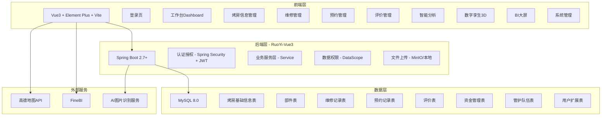
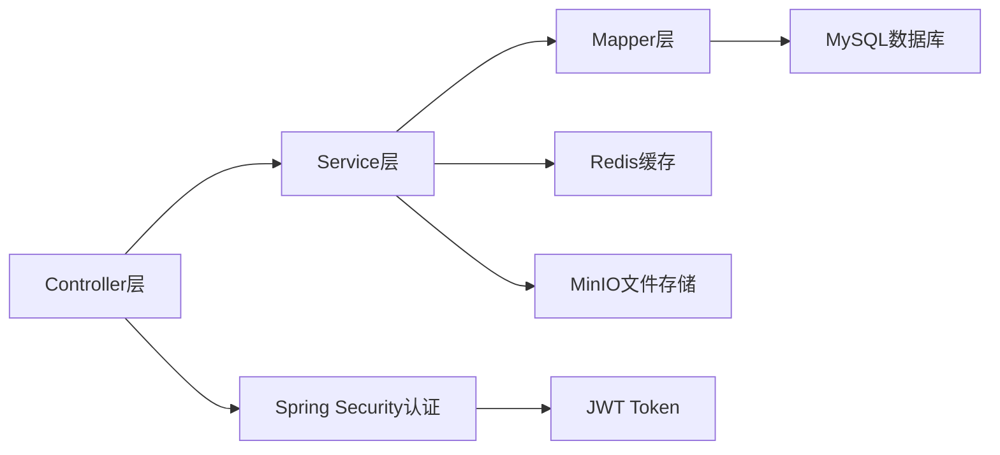
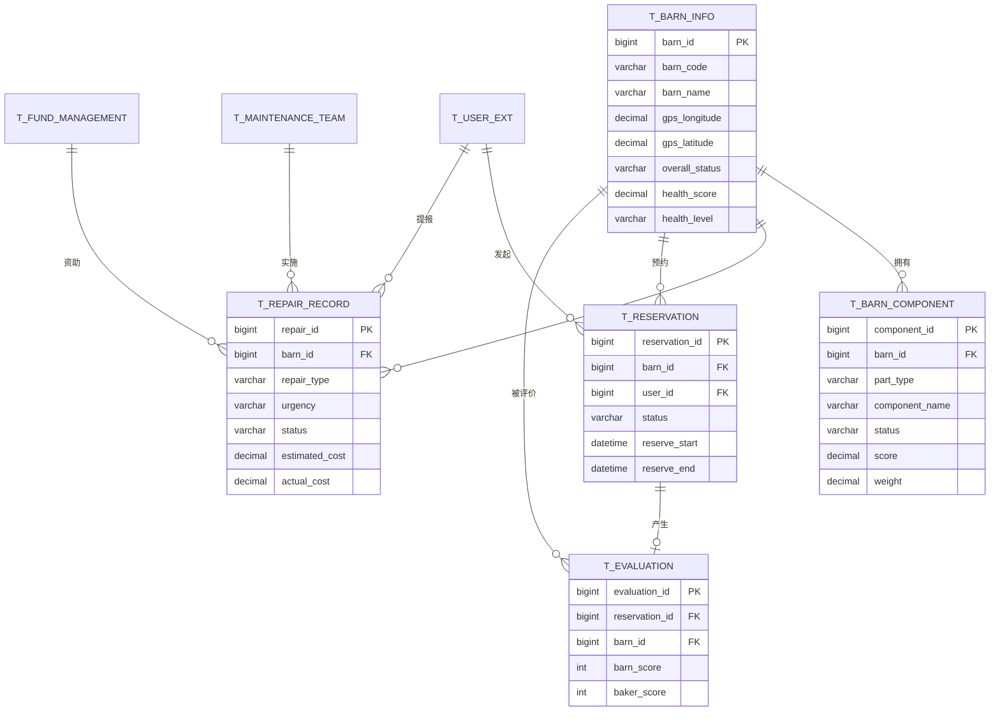

# 烤房全周期信息化管理平台 — 技术架构文档

## 1. 架构设计



## 2. 技术说明

- **前端**：Vue3 + Element Plus + Vite + ECharts + Vue Router + Pinia
- **初始化工具**：Vite
- **后端**：RuoYi-Vue3（Spring Boot 2.7+ / MyBatis / Spring Security / JWT）
- **数据库**：MySQL 8.0（前端使用Mock数据开发，后端对接RuoYi）
- **地图**：高德地图JS API 2.0
- **3D**：Three.js（数字孪生模块）
- **BI**：FineBI iframe嵌入 / ECharts自研大屏
- **图标**：@element-plus/icons-vue + lucide-vue-next

## 3. 路由定义

| 路由 | 用途 | 权限 |
|------|------|------|
| /login | 登录页 | 公开 |
| / | 工作台Dashboard | 登录用户 |
| /barn/list | 烤房列表 | 技术员及以上 |
| /barn/detail/:id | 烤房详情 | 技术员及以上 |
| /barn/add | 新建烤房 | 市局管理员 |
| /barn/edit/:id | 编辑烤房 | 技术员及以上 |
| /repair/list | 维修列表 | 技术员及以上 |
| /repair/apply | 维修提报 | 技术员 |
| /repair/approve/:id | 维修审批 | 站管理员及以上 |
| /repair/accept/:id | 维修验收 | 站管理员及以上 |
| /repair/fund | 维修资金 | 县区局及以上 |
| /reservation/list | 预约审核 | 合作社及以上 |
| /reservation/calendar | 预约日历 | 合作社及以上 |
| /evaluation/list | 评价列表 | 合作社及以上 |
| /evaluation/analysis | 评价分析 | 站管理员及以上 |
| /health/analysis | 健康评分 | 县区局及以上 |
| /recommend | 智能推荐 | 县区局及以上 |
| /digital-twin | 数字孪生 | 县区局及以上 |
| /bi/dashboard | BI大屏 | 县区局及以上 |
| /team/list | 管护队伍 | 合作社及以上 |
| /annual/update | 年度更新 | 市局管理员 |
| /system/user | 用户管理 | 市局管理员 |
| /system/role | 角色管理 | 市局管理员 |
| /system/menu | 菜单管理 | 市局管理员 |
| /system/dept | 部门管理 | 市局管理员 |
| /system/dict | 字典管理 | 市局管理员 |
| /system/log | 操作日志 | 市局管理员 |

## 4. API定义

### 4.1 认证接口

```typescript
// 登录
POST /auth/login
Request: { username: string; password: string; code: string; uuid: string }
Response: { token: string }

// 获取用户信息
GET /auth/info
Response: { user: UserInfo; roles: string[]; permissions: string[] }

// 退出登录
POST /auth/logout
```

### 4.2 烤房接口

```typescript
// 烤房列表（分页）
GET /barn/barn/list
Params: { pageNum: number; pageSize: number; countyCode?: string; townCode?: string; status?: string; healthLevel?: string; barnCode?: string }

// 烤房详情
GET /barn/barn/:id

// 新增烤房
POST /barn/barn
Body: BarnInfo

// 修改烤房
PUT /barn/barn
Body: BarnInfo

// 删除烤房
DELETE /barn/barn/:id

// 烤房部件列表
GET /barn/component/list/:barnId

// 更新部件状态
PUT /barn/component
Body: BarnComponent
```

### 4.3 维修接口

```typescript
// 维修列表
GET /repair/record/list
Params: { pageNum: number; pageSize: number; status?: string; urgency?: string; repairType?: string }

// 提报维修
POST /repair/record
Body: RepairRecord

// 审批维修
PUT /repair/record/approve
Body: { repairId: number; status: string; auditOpinion: string }

// 验收维修
PUT /repair/record/accept
Body: { repairId: number; acceptResult: string; acceptOpinion: string; acceptPhotos: string }
```

### 4.4 预约接口

```typescript
// 预约列表
GET /reservation/list
Params: { pageNum: number; pageSize: number; status?: string; barnId?: number }

// 审核预约
PUT /reservation/approve
Body: { reservationId: number; status: string; reviewOpinion?: string }

// 预约日历数据
GET /reservation/calendar
Params: { barnId?: number; month: string }
```

### 4.5 评价接口

```typescript
// 评价列表
GET /evaluation/list
Params: { pageNum: number; pageSize: number; barnId?: number; bakerId?: number }

// 评价统计
GET /evaluation/statistics
```

### 4.6 健康评分接口

```typescript
// 健康评分列表
GET /health/score/list
Params: { pageNum: number; pageSize: number; healthLevel?: string; countyCode?: string }

// 单烤房健康详情
GET /health/score/:barnId

// 退化曲线数据
GET /health/prediction/:barnId
```

### 4.7 数据模型定义

```typescript
interface BarnInfo {
  barnId: number
  barnCode: string
  barnName: string
  gpsLongitude: number
  gpsLatitude: number
  gpsAddress: string
  countyCode: string
  townCode: string
  villageCode: string
  stationId: number
  cooperativeId: number
  poundGroupId: number
  buildYear: number
  buildProject: string
  buildCost: number
  barnType: string
  capacity: number
  benefitArea: number
  overallStatus: string
  healthScore: number
  healthLevel: string
  isIdle: number
  currentUserId: number
  predictedLifeYears: number
  optimalRepairDate: string
}

interface BarnComponent {
  componentId: number
  barnId: number
  partType: string
  componentName: string
  componentCode: string
  status: string
  damageLevel: string
  damagePhoto: string
  score: number
  weight: number
  lastCheckTime: string
  remark: string
}

interface RepairRecord {
  repairId: number
  barnId: number
  repairType: string
  urgency: string
  applicantId: number
  applyTime: string
  applyDesc: string
  applyPhotos: string
  estimatedCost: number
  actualCost: number
  status: string
  auditorId: number
  auditTime: string
  auditOpinion: string
  implementTeam: string
  startDate: string
  endDate: string
  completionPhotos: string
  acceptorId: number
  acceptTime: string
  acceptResult: string
  acceptOpinion: string
  roiScore: number
}

interface Reservation {
  reservationId: number
  barnId: number
  userId: number
  reserveStart: string
  reserveEnd: string
  status: string
  reviewerId: number
  reviewTime: string
  actualStart: string
  actualEnd: string
  leafWeight: number
  isTimeout: number
  timeoutHours: number
}

interface Evaluation {
  evaluationId: number
  reservationId: number
  barnId: number
  evaluatorId: number
  bakerId: number
  barnScore: number
  barnComment: string
  bakerScore: number
  bakerComment: string
  evaluateTime: string
}
```

## 5. 后端架构图



## 6. 数据模型

### 6.1 ER关系图



## 7. 前端项目结构

```
src/
├── api/                    # API请求模块
│   ├── barn.ts
│   ├── repair.ts
│   ├── reservation.ts
│   ├── evaluation.ts
│   ├── health.ts
│   └── system.ts
├── assets/                 # 静态资源
│   ├── images/
│   └── styles/
│       └── variables.scss  # 全局SCSS变量
├── components/             # 公共组件
│   ├── Layout/             # 布局组件
│   │   ├── AppLayout.vue
│   │   ├── Sidebar.vue
│   │   ├── Navbar.vue
│   │   └── TagsView.vue
│   ├── HealthGauge.vue     # 健康评分仪表盘
│   ├── StatusTag.vue       # 状态标签
│   ├── ImageUpload.vue     # 图片上传
│   └── DataCard.vue        # 数据卡片
├── composables/            # 组合式函数
│   ├── useTheme.ts
│   └── usePermission.ts
├── mock/                   # Mock数据
│   ├── barn.ts
│   ├── repair.ts
│   ├── reservation.ts
│   └── dashboard.ts
├── pages/                  # 页面组件
│   ├── login/
│   │   └── LoginView.vue
│   ├── dashboard/
│   │   └── DashboardView.vue
│   ├── barn/
│   │   ├── BarnList.vue
│   │   ├── BarnDetail.vue
│   │   ├── BarnAdd.vue
│   │   └── BarnEdit.vue
│   ├── repair/
│   │   ├── RepairList.vue
│   │   ├── RepairApply.vue
│   │   ├── RepairApprove.vue
│   │   ├── RepairAccept.vue
│   │   └── RepairFund.vue
│   ├── reservation/
│   │   ├── ReservationList.vue
│   │   └── ReservationCalendar.vue
│   ├── evaluation/
│   │   ├── EvaluationList.vue
│   │   └── EvaluationAnalysis.vue
│   ├── health/
│   │   └── HealthAnalysis.vue
│   ├── digital-twin/
│   │   └── DigitalTwin.vue
│   ├── bi/
│   │   └── BiDashboard.vue
│   ├── team/
│   │   └── TeamList.vue
│   ├── annual/
│   │   └── AnnualUpdate.vue
│   └── system/
│       ├── UserManage.vue
│       ├── RoleManage.vue
│       ├── MenuManage.vue
│       ├── DeptManage.vue
│       ├── DictManage.vue
│       └── LogManage.vue
├── router/
│   └── index.ts
├── store/                  # Pinia状态管理
│   ├── index.ts
│   ├── user.ts
│   ├── app.ts
│   └── permission.ts
├── lib/
│   └── utils.ts
├── App.vue
├── main.ts
└── style.css
```
